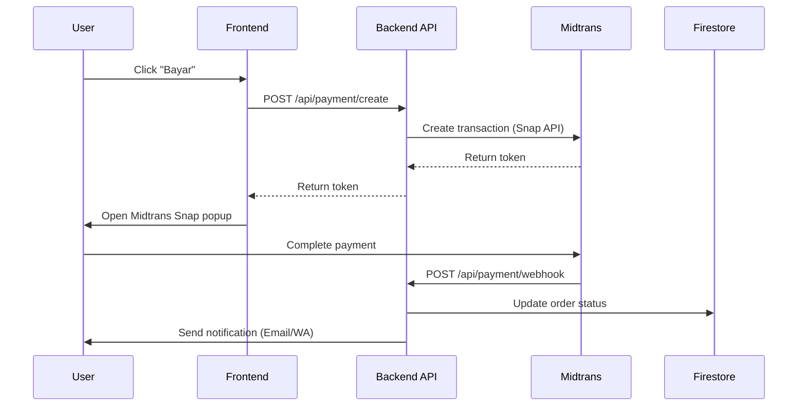
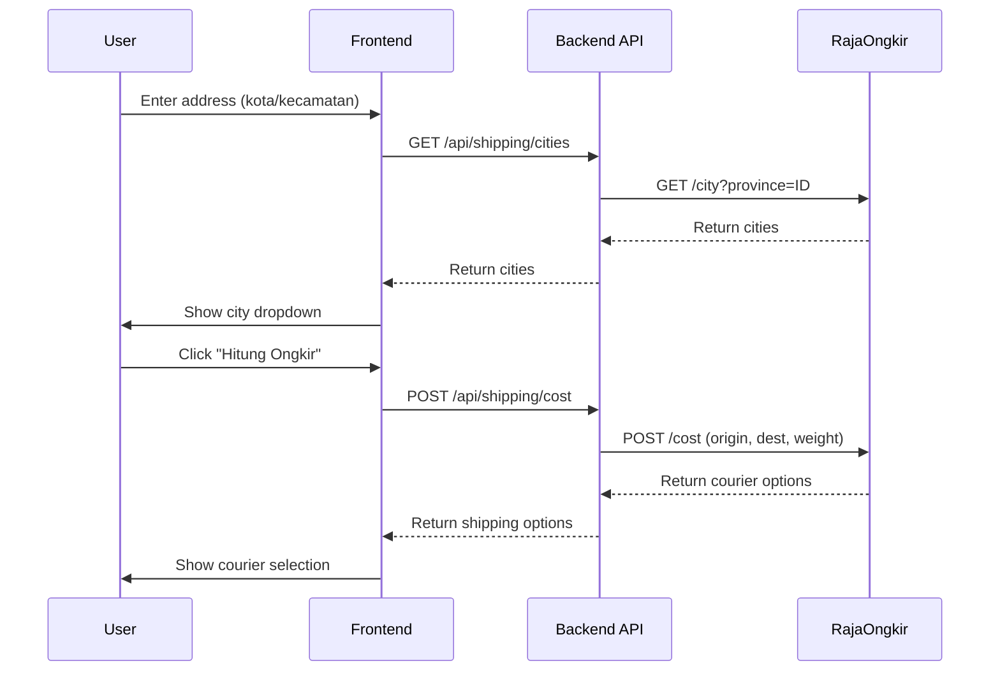

# 🏗️ Architecture Detail - Implementation Guide

> **Phase 3.3:** Architecture Detail  
> **Purpose:** Blueprint teknis untuk development Phase 4  
> **Base Reference:** `docs/architecture.md` (High-level)

---

## 1. Component Structure (Folder Tree)

```
src/
├── app/                           # Next.js 15 App Router
│   ├── (auth)/                    # Auth route group (no layout nesting)
│   │   ├── login/
│   │   │   └── page.tsx           # Login page
│   │   ├── register/
│   │   │   └── page.tsx           # Register page
│   │   └── layout.tsx             # Auth layout (centered, minimal)
│   │
│   ├── (shop)/                    # Main shop route group
│   │   ├── page.tsx               # Homepage (Landing)
│   │   ├── products/
│   │   │   ├── page.tsx           # Product catalog
│   │   │   └── [slug]/
│   │   │       └── page.tsx       # Product detail page (PDP)
│   │   ├── cart/
│   │   │   └── page.tsx           # Shopping cart
│   │   ├── checkout/
│   │   │   └── page.tsx           # Checkout flow (3 steps)
│   │   ├── orders/
│   │   │   ├── page.tsx           # Order history list
│   │   │   └── [id]/
│   │   │       └── page.tsx       # Order detail & tracking
│   │   ├── profile/
│   │   │   ├── page.tsx           # User profile
│   │   │   └── addresses/
│   │   │       └── page.tsx       # Manage addresses
│   │   ├── stores/
│   │   │   └── page.tsx           # Store locations
│   │   └── layout.tsx             # Shop layout (Header, Footer, BottomNav)
│   │
│   ├── admin/                     # Admin dashboard (protected)
│   │   ├── page.tsx               # Dashboard overview
│   │   ├── products/
│   │   │   ├── page.tsx           # Product list
│   │   │   ├── new/
│   │   │   │   └── page.tsx       # Create product
│   │   │   └── [id]/
│   │   │       └── page.tsx       # Edit product
│   │   ├── orders/
│   │   │   ├── page.tsx           # Order list
│   │   │   └── [id]/
│   │   │       └── page.tsx       # Order detail (status update)
│   │   ├── settings/
│   │   │   └── page.tsx           # Admin settings
│   │   └── layout.tsx             # Admin layout (Sidebar)
│   │
│   ├── api/                       # API Route Handlers
│   │   ├── auth/
│   │   │   └── [...nextauth]/     # NextAuth (if used) or custom
│   │   ├── products/
│   │   │   ├── route.ts           # GET (list), POST (create)
│   │   │   └── [id]/
│   │   │       └── route.ts       # GET, PUT, DELETE
│   │   ├── cart/
│   │   │   └── route.ts           # POST (sync cart)
│   │   ├── orders/
│   │   │   ├── route.ts           # GET (list), POST (create)
│   │   │   └── [id]/
│   │   │       └── route.ts       # GET, PATCH (status)
│   │   ├── payment/
│   │   │   ├── create/
│   │   │   │   └── route.ts       # POST (create Midtrans transaction)
│   │   │   └── webhook/
│   │   │       └── route.ts       # POST (Midtrans callback)
│   │   └── shipping/
│   │       ├── provinces/
│   │       │   └── route.ts       # GET provinces (RajaOngkir)
│   │       ├── cities/
│   │       │   └── route.ts       # GET cities (RajaOngkir)
│   │       └── cost/
│   │           └── route.ts       # POST calculate shipping
│   │
│   ├── layout.tsx                 # Root layout
│   ├── loading.tsx                # Global loading spinner
│   ├── error.tsx                  # Error boundary
│   └── not-found.tsx              # 404 page
│
├── components/
│   ├── ui/                        # Shadcn/ui base components
│   │   ├── button.tsx
│   │   ├── input.tsx
│   │   ├── card.tsx
│   │   ├── dialog.tsx
│   │   ├── dropdown-menu.tsx
│   │   ├── form.tsx
│   │   ├── select.tsx
│   │   ├── sheet.tsx
│   │   ├── skeleton.tsx
│   │   ├── table.tsx
│   │   ├── tabs.tsx
│   │   └── toast.tsx
│   │
│   ├── layout/                    # Layout components
│   │   ├── header.tsx             # Desktop header
│   │   ├── footer.tsx             # Site footer
│   │   ├── mobile-nav.tsx         # Bottom navigation
│   │   ├── sidebar.tsx            # Admin sidebar
│   │   └── search-bar.tsx         # Search with autocomplete
│   │
│   ├── product/                   # Product-related components
│   │   ├── product-card.tsx       # Card for catalog grid
│   │   ├── product-grid.tsx       # Grid container
│   │   ├── product-filter.tsx     # Filter sidebar/sheet
│   │   ├── product-gallery.tsx    # Image gallery for PDP
│   │   ├── product-specs.tsx      # Specifications table
│   │   ├── stock-badge.tsx        # Stock indicator
│   │   └── add-to-cart.tsx        # Add to cart button + qty
│   │
│   ├── cart/                      # Cart components
│   │   ├── cart-item.tsx          # Single cart item row
│   │   ├── cart-summary.tsx       # Price summary
│   │   └── cart-empty.tsx         # Empty state
│   │
│   ├── checkout/                  # Checkout components
│   │   ├── checkout-steps.tsx     # Step indicator
│   │   ├── address-form.tsx       # Address input form
│   │   ├── address-select.tsx     # Saved address selector
│   │   ├── shipping-options.tsx   # Courier selection
│   │   └── payment-methods.tsx    # Payment method selection
│   │
│   ├── order/                     # Order components
│   │   ├── order-card.tsx         # Order in history list
│   │   ├── order-status.tsx       # Status badge/timeline
│   │   └── order-items.tsx        # Items in order
│   │
│   ├── admin/                     # Admin-specific components
│   │   ├── stats-card.tsx         # Dashboard stat card
│   │   ├── data-table.tsx         # Generic data table
│   │   ├── product-form.tsx       # Create/Edit product form
│   │   └── order-actions.tsx      # Order status actions
│   │
│   └── shared/                    # Shared/common components
│       ├── page-header.tsx        # Page title + breadcrumb
│       ├── empty-state.tsx        # Generic empty state
│       ├── loading-spinner.tsx    # Loading indicator
│       └── whatsapp-button.tsx    # Floating WA button
│
├── lib/                           # Utilities & configs
│   ├── firebase/
│   │   ├── config.ts              # Firebase initialization
│   │   ├── auth.ts                # Auth helpers
│   │   ├── firestore.ts           # Firestore helpers
│   │   └── storage.ts             # Storage helpers
│   ├── utils.ts                   # General utilities (cn, formatPrice)
│   ├── constants.ts               # App constants
│   └── api/
│       ├── midtrans.ts            # Midtrans API wrapper
│       └── rajaongkir.ts          # RajaOngkir API wrapper
│
├── hooks/                         # Custom React hooks
│   ├── use-auth.ts                # Auth state hook
│   ├── use-cart.ts                # Cart operations hook
│   ├── use-products.ts            # Product queries (React Query)
│   ├── use-orders.ts              # Order queries
│   ├── use-shipping.ts            # Shipping calculation
│   └── use-media-query.ts         # Responsive breakpoint
│
├── stores/                        # Zustand stores
│   ├── cart-store.ts              # Cart state
│   ├── auth-store.ts              # User session state
│   ├── ui-store.ts                # UI state (sidebar, modal)
│   └── checkout-store.ts          # Checkout flow state
│
├── types/                         # TypeScript types
│   ├── product.ts                 # Product, Category types
│   ├── order.ts                   # Order, OrderItem types
│   ├── user.ts                    # User, Address types
│   ├── payment.ts                 # Payment types
│   ├── shipment.ts                # Shipment types
│   └── api.ts                     # API response types
│
└── schemas/                       # Zod validation schemas
    ├── product-schema.ts          # Product validation
    ├── order-schema.ts            # Order/checkout validation
    ├── user-schema.ts             # User profile validation
    └── address-schema.ts          # Address validation
```

---

## 2. State Management Strategy

### 2.1 State Categories

| State Type | Tool | Use Case |
|------------|------|----------|
| **Server State** | React Query | Products, Orders, User data (from Firestore) |
| **Client State** | Zustand | Cart, UI, Checkout flow |
| **URL State** | Next.js searchParams | Filters, Pagination, Search query |
| **Form State** | React Hook Form + Zod | Forms (checkout, product edit) |

### 2.2 Zustand Stores Detail

#### `cart-store.ts`

```typescript
interface CartItem {
  productId: string;
  productName: string;
  productPrice: number;
  productImage: string;
  quantity: number;
  stock: number; // For validation
}

interface CartStore {
  items: CartItem[];
  // Actions
  addItem: (product: Product, qty: number) => void;
  updateQuantity: (productId: string, qty: number) => void;
  removeItem: (productId: string) => void;
  clearCart: () => void;
  // Computed
  totalItems: () => number;
  totalPrice: () => number;
}
```

**Persistence:** `sessionStorage` (guest) + sync to Firestore (logged-in user)

---

#### `auth-store.ts`

```typescript
interface AuthStore {
  user: User | null;
  isLoading: boolean;
  isAdmin: boolean;
  // Actions
  setUser: (user: User | null) => void;
  logout: () => Promise<void>;
}
```

---

#### `checkout-store.ts`

```typescript
interface CheckoutStore {
  step: 1 | 2 | 3;
  // Step 1: Address
  selectedAddressId: string | null;
  guestAddress: Address | null;
  // Step 2: Shipping
  selectedCourier: string | null;
  selectedService: string | null;
  shippingCost: number;
  // Step 3: Payment
  selectedPaymentMethod: string | null;
  // Actions
  setStep: (step: 1 | 2 | 3) => void;
  setAddress: (addressId: string) => void;
  setShipping: (courier: string, service: string, cost: number) => void;
  setPaymentMethod: (method: string) => void;
  reset: () => void;
}
```

---

#### `ui-store.ts`

```typescript
interface UIStore {
  isSidebarOpen: boolean;
  isCartSheetOpen: boolean;
  isMobileNavVisible: boolean;
  // Actions
  toggleSidebar: () => void;
  openCartSheet: () => void;
  closeCartSheet: () => void;
}
```

---

### 2.3 React Query Queries

| Query Key | Fetcher | staleTime | Use Case |
|-----------|---------|-----------|----------|
| `['products']` | `getProducts()` | 5 min | Product catalog |
| `['products', slug]` | `getProductBySlug()` | 5 min | Product detail |
| `['categories']` | `getCategories()` | 30 min | Category list |
| `['orders', userId]` | `getUserOrders()` | 1 min | Order history |
| `['order', orderId]` | `getOrderById()` | 30 sec | Order detail |
| `['user', userId]` | `getUserProfile()` | 5 min | User profile |

---

## 3. API Routes Specification

### 3.1 Product APIs

| Method | Route | Description | Auth |
|--------|-------|-------------|------|
| `GET` | `/api/products` | List products (with filters) | Public |
| `GET` | `/api/products/[id]` | Get product detail | Public |
| `POST` | `/api/products` | Create product | Admin |
| `PUT` | `/api/products/[id]` | Update product | Admin |
| `DELETE` | `/api/products/[id]` | Delete product | Admin |

**Query Params (GET /api/products):**

- `category` - Filter by category slug
- `search` - Search query
- `sort` - `price_asc`, `price_desc`, `newest`
- `page` - Pagination
- `limit` - Items per page (default 20)

---

### 3.2 Order APIs

| Method | Route | Description | Auth |
|--------|-------|-------------|------|
| `GET` | `/api/orders` | List user orders | User |
| `GET` | `/api/orders/[id]` | Get order detail | User/Admin |
| `POST` | `/api/orders` | Create order | User |
| `PATCH` | `/api/orders/[id]` | Update status | Admin |

**POST /api/orders Request Body:**

```typescript
{
  items: CartItem[];
  addressId: string;
  courier: string;
  service: string;
  shippingCost: number;
  paymentMethod: string;
  notes?: string;
}
```

---

### 3.3 Payment APIs

| Method | Route | Description | Auth |
|--------|-------|-------------|------|
| `POST` | `/api/payment/create` | Create payment transaction | User |
| `POST` | `/api/payment/webhook` | Handle Midtrans callback | Midtrans |

**POST /api/payment/create:**

- Input: `{ orderId: string }`
- Output: `{ token: string, redirect_url: string }`

**Webhook Verification:**

- Validate `signature_key` from Midtrans
- Update order status based on `transaction_status`

---

### 3.4 Shipping APIs

| Method | Route | Description | Auth |
|--------|-------|-------------|------|
| `GET` | `/api/shipping/provinces` | List provinces | Public |
| `GET` | `/api/shipping/cities?province=ID` | List cities | Public |
| `POST` | `/api/shipping/cost` | Calculate shipping cost | User |

**POST /api/shipping/cost:**

```typescript
// Request
{
  origin: string;      // City ID (TIB warehouse)
  destination: string; // City ID (user)
  weight: number;      // In grams
  courier: string;     // "jne", "tiki", "sicepat"
}

// Response
{
  results: [
    {
      code: "jne",
      name: "JNE",
      costs: [
        { service: "REG", cost: 15000, etd: "2-3" },
        { service: "YES", cost: 25000, etd: "1-1" }
      ]
    }
  ]
}
```

---

## 4. Third-Party Integration Details

### 4.1 Midtrans Flow



**Environment Variables:**

```env
MIDTRANS_SERVER_KEY=SB-Mid-server-xxx
NEXT_PUBLIC_MIDTRANS_CLIENT_KEY=SB-Mid-client-xxx
MIDTRANS_IS_PRODUCTION=false
```

---

### 4.2 RajaOngkir Flow



**Environment Variables:**

```env
RAJAONGKIR_API_KEY=xxx
RAJAONGKIR_BASE_URL=https://api.rajaongkir.com/starter
```

---

### 4.3 WhatsApp Integration

**Strategy:** Deep Link (no API needed for MVP)

```typescript
// lib/utils.ts
export function getWhatsAppLink(phone: string, message: string): string {
  const encodedMessage = encodeURIComponent(message);
  return `https://wa.me/${phone}?text=${encodedMessage}`;
}

// Usage: Product inquiry
const waLink = getWhatsAppLink(
  "6281252462983",
  `Halo, saya tertarik dengan produk ${productName}. Apakah stok tersedia?`
);
```

---

## 5. Route Protection (Middleware)

```typescript
// middleware.ts
import { NextResponse } from 'next/server';
import type { NextRequest } from 'next/server';

export function middleware(request: NextRequest) {
  const { pathname } = request.nextUrl;
  const token = request.cookies.get('firebase-token');

  // Protect /admin routes
  if (pathname.startsWith('/admin')) {
    if (!token) {
      return NextResponse.redirect(new URL('/login', request.url));
    }
    // Note: Role check happens in layout.tsx (server component)
  }

  // Protect /orders, /profile routes
  if (pathname.startsWith('/orders') || pathname.startsWith('/profile')) {
    if (!token) {
      return NextResponse.redirect(new URL('/login', request.url));
    }
  }

  return NextResponse.next();
}

export const config = {
  matcher: ['/admin/:path*', '/orders/:path*', '/profile/:path*'],
};
```

---

## 6. Environment Variables

```env
# Firebase
NEXT_PUBLIC_FIREBASE_API_KEY=
NEXT_PUBLIC_FIREBASE_AUTH_DOMAIN=
NEXT_PUBLIC_FIREBASE_PROJECT_ID=
NEXT_PUBLIC_FIREBASE_STORAGE_BUCKET=
NEXT_PUBLIC_FIREBASE_MESSAGING_SENDER_ID=
NEXT_PUBLIC_FIREBASE_APP_ID=
FIREBASE_ADMIN_PRIVATE_KEY=

# Payment (Midtrans)
MIDTRANS_SERVER_KEY=
NEXT_PUBLIC_MIDTRANS_CLIENT_KEY=
MIDTRANS_IS_PRODUCTION=false

# Shipping (RajaOngkir)
RAJAONGKIR_API_KEY=
RAJAONGKIR_BASE_URL=

# App
NEXT_PUBLIC_BASE_URL=http://localhost:3000
NEXT_PUBLIC_WHATSAPP_NUMBER=6281252462983
```

---

*Last updated: 6 Januari 2026*
