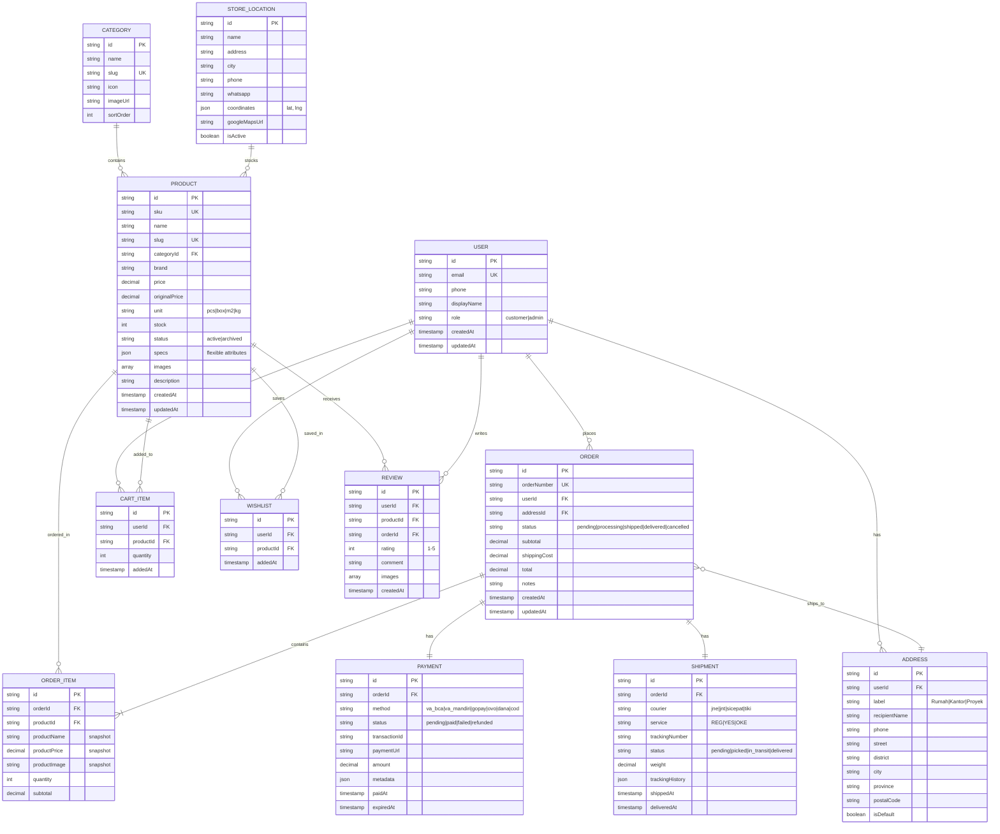

# 📊 Entity Relationship Diagram (ERD)

> **Phase 3.2:** Database Design  
> **Approach:** Agnostic (Portable to SQL or NoSQL)  
> **Current Implementation:** Firebase Firestore  
> **Fallback Option:** Supabase (PostgreSQL)

---

## 1. Conceptual ERD (Database Agnostic)



---

## 2. Entity Descriptions

| Entity | Description | Key Relationships |
|--------|-------------|-------------------|
| **USER** | Customer atau Admin | Has many Orders, Addresses, Cart Items |
| **ADDRESS** | Alamat pengiriman tersimpan | Belongs to User, Used by Order |
| **CATEGORY** | Kategori produk (Semen, Keramik, dll) | Has many Products |
| **PRODUCT** | Produk bahan bangunan | Belongs to Category, Has Reviews |
| **CART_ITEM** | Item di keranjang belanja | Links User ↔ Product |
| **WISHLIST** | Produk favorit user | Links User ↔ Product |
| **ORDER** | Transaksi pembelian | Has many OrderItems, one Payment, one Shipment |
| **ORDER_ITEM** | Detail item dalam order | Snapshot data produk saat beli |
| **PAYMENT** | Info pembayaran (Midtrans) | One-to-one with Order |
| **SHIPMENT** | Info pengiriman | One-to-one with Order |
| **REVIEW** | Ulasan produk | Links User, Product, Order |
| **STORE_LOCATION** | Lokasi toko fisik TIB | Independent entity |

---

## 3. Key Design Decisions

### 3.1 Snapshot Strategy (Portability-Safe Denormalization)

**Problem:** Di e-commerce, jika admin ubah harga/nama produk, order history harus tetap menampilkan data **saat pembelian**.

**Solution:** `ORDER_ITEM` menyimpan snapshot:

- `productName` (copy)
- `productPrice` (copy)
- `productImage` (copy)

```
ORDER_ITEM = {
  productId: "prod_123",        // Reference (for lookup)
  productName: "Semen Gresik",  // Snapshot (immutable)
  productPrice: 75000,          // Snapshot (immutable)
  ...
}
```

**Portability:** Ini adalah **best practice universal** (SQL maupun NoSQL). Di SQL, ini jadi kolom biasa. Di NoSQL, ini jadi field dalam dokumen.

---

### 3.2 Flexible Product Specs (JSONB Concept)

**Problem:** Produk bahan bangunan punya atribut berbeda:

- Semen: Berat, Tipe (PCC, OPC)
- Keramik: Ukuran, Motif, Isi/dus
- Cat: Volume, Warna, Finishing

**Solution:** Field `specs` sebagai JSON/Map:

```json
// Semen
{ "weight": "50kg", "type": "PCC" }

// Keramik
{ "size": "60x60cm", "finish": "Glossy", "pcs_per_box": 4 }

// Cat
{ "volume": "5L", "color": "#FFFFFF", "finish": "Matte" }
```

**Portability:**

- **Firestore:** Native Map/Object support
- **PostgreSQL/Supabase:** Use `JSONB` column (indexable, queryable)

---

### 3.3 Flat Structure (Anti Deep-Nesting)

**Rule:** Maksimal 1 level sub-collection di Firestore.

**Good ✅:**

```
/users/{userId}
/orders/{orderId}
/orders/{orderId}/items/{itemId}  ← 1 level deep OK
```

**Bad ❌:**

```
/users/{userId}/orders/{orderId}/items/{itemId}/reviews/{reviewId}
```

**Why:** Flat structure lebih mudah di-migrate ke SQL tables. Setiap "collection" = 1 table.

---

## 4. Firestore Implementation

### 4.1 Collection Structure

```
firestore/
├── users/
│   └── {userId}
│       ├── addresses/          ← Sub-collection
│       │   └── {addressId}
│       └── cartItems/          ← Sub-collection
│           └── {cartItemId}
│
├── categories/
│   └── {categoryId}
│
├── products/
│   └── {productId}
│
├── orders/
│   └── {orderId}
│       └── items/              ← Sub-collection
│           └── {itemId}
│
├── payments/
│   └── {paymentId}
│
├── shipments/
│   └── {shipmentId}
│
├── reviews/
│   └── {reviewId}
│
├── wishlists/
│   └── {wishlistId}
│
└── storeLocations/
    └── {locationId}
```

### 4.2 Index Requirements

| Collection | Fields to Index | Query Use Case |
|------------|-----------------|----------------|
| `products` | `categoryId`, `status` | Filter by category |
| `products` | `price` (ASC/DESC) | Sort by price |
| `orders` | `userId`, `status`, `createdAt` | User order history |
| `orders` | `status`, `createdAt` | Admin order list |
| `reviews` | `productId`, `createdAt` | Product reviews |

---

## 5. Migration Path (Future: Supabase/PostgreSQL)

Jika nanti migrasi ke SQL, mapping-nya:

| Firestore Collection | PostgreSQL Table | Notes |
|---------------------|------------------|-------|
| `users` | `users` | Direct mapping |
| `users/{id}/addresses` | `addresses` | Add `user_id` FK |
| `users/{id}/cartItems` | `cart_items` | Add `user_id` FK |
| `products` | `products` | `specs` → JSONB column |
| `orders` | `orders` | Direct mapping |
| `orders/{id}/items` | `order_items` | Add `order_id` FK |
| `payments` | `payments` | Add `order_id` FK |
| `shipments` | `shipments` | Add `order_id` FK |

**Migration Script Concept:**

```javascript
// Export Firestore → JSON → Import to PostgreSQL
// Each collection becomes a table
// Sub-collections get parent ID as foreign key
```

---

## 6. Security Rules Skeleton

```javascript
// Firestore Security Rules (simplified)
rules_version = '2';
service cloud.firestore {
  match /databases/{database}/documents {
    
    // Users: Read own data, Admin read all
    match /users/{userId} {
      allow read: if request.auth.uid == userId || isAdmin();
      allow write: if request.auth.uid == userId;
    }
    
    // Products: Public read, Admin write
    match /products/{productId} {
      allow read: if true;
      allow write: if isAdmin();
    }
    
    // Orders: User read own, Admin read all
    match /orders/{orderId} {
      allow read: if resource.data.userId == request.auth.uid || isAdmin();
      allow create: if request.auth != null;
      allow update: if isAdmin();
    }
    
    function isAdmin() {
      return get(/databases/$(database)/documents/users/$(request.auth.uid)).data.role == 'admin';
    }
  }
}
```

---

*Last updated: 6 Januari 2026*
