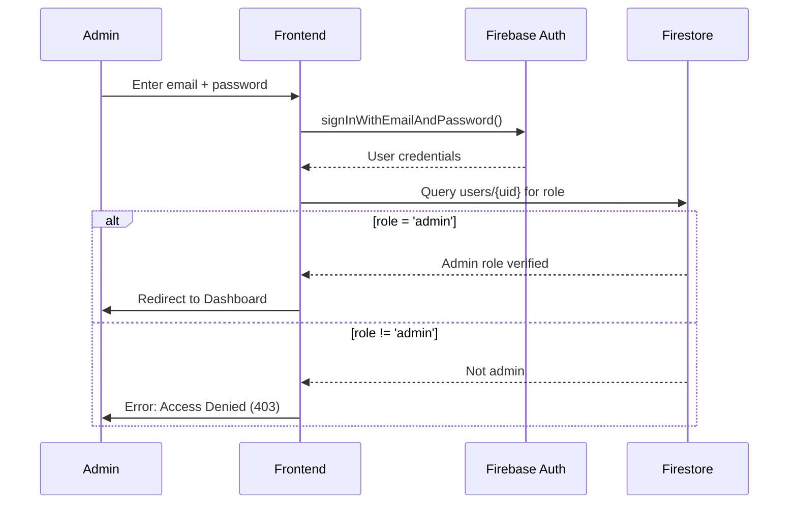
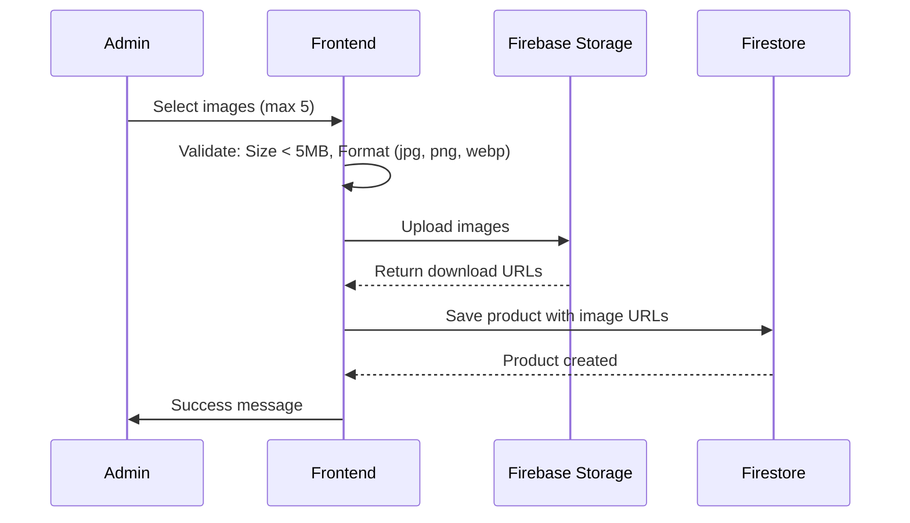
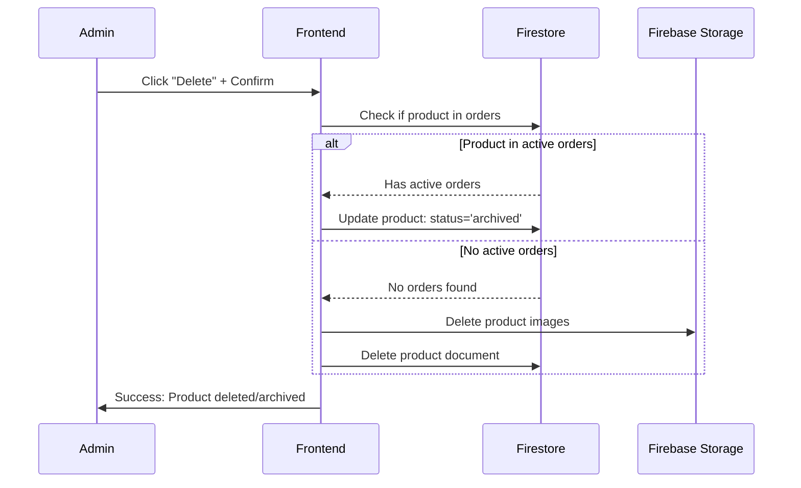
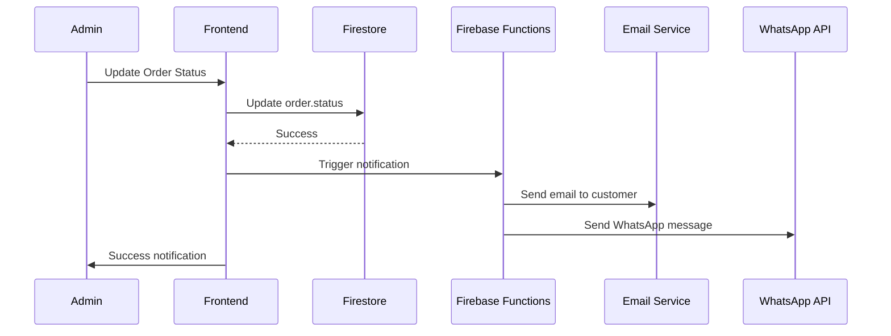

# Admin Flow - Turen Indah Bangunan

> **Phase 3.1:** Admin Flow & Management  
> **Purpose:** Visualize admin workflows untuk product & order management  
> **User:** Admin staff dengan full CRUD permissions

---

## Admin Flow Diagram (Mermaid)

```mermaid
flowchart TD
    Start([Admin Accesses Admin Panel]) --> LoginCheck{Already Logged In?}
    
    LoginCheck -->|No| Login[Login Page]
    LoginCheck -->|Yes| RoleCheck{Admin Role Verified?}
    
    Login --> AuthValidation{Credentials Valid?}
    AuthValidation -->|Invalid| LoginError[Error: Invalid Email/Password]
    AuthValidation -->|Valid| RoleCheck
    LoginError --> Login
    
    RoleCheck -->|Not Admin| AccessDenied[Error: Access Denied<br/>403 Forbidden]
    RoleCheck -->|Admin| Dashboard[Admin Dashboard]
    
    AccessDenied --> End([End])
    
    Dashboard --> DashboardView[Dashboard Overview]
    DashboardView --> StatsCards[Display Stats Cards:<br/>Total Sales, Orders, Users, Products]
    StatsCards --> RecentOrders[Recent Orders List]
    RecentOrders --> LowStockAlerts[Low Stock Alerts]
    LowStockAlerts --> QuickActions[Quick Actions:<br/>Add Product, View Orders]
    
    Dashboard --> MainMenu{Select Menu}
    MainMenu -->|Manage Products| ProductsModule[Products Management]
    MainMenu -->|Manage Orders| OrdersModule[Orders Management]
    MainMenu -->|View Analytics| AnalyticsModule[Analytics Dashboard]
    MainMenu -->|Settings| SettingsModule[Settings Page]
    MainMenu -->|Logout| Logout[Logout]
    
    Logout --> End
    
    %% === PRODUCTS MODULE ===
    ProductsModule --> ProductsList[Products List Page]
    ProductsList --> ProductsActions{Admin Action}
    
    ProductsActions -->|Search/Filter| ProductsFilter[Filter by Category, Stock Status]
    ProductsActions -->|Create Product| CreateProduct[Create New Product Form]
    ProductsActions -->|Edit Product| SelectProduct1[Select Product to Edit]
    ProductsActions -->|Delete Product| SelectProduct2[Select Product to Delete]
    
    ProductsFilter --> ProductsList
    
    %% Create Product Flow
    CreateProduct --> ProductForm[Product Form:<br/>Name, Category, Price,<br/>Stock, Images, Specs]
    ProductForm --> FormValidation1{Form Valid?}
    FormValidation1 -->|Invalid| FormError1[Error: Missing Required Fields]
    FormValidation1 -->|Valid| UploadImages[Upload Product Images<br/>to Firebase Storage]
    FormError1 --> ProductForm
    
    UploadImages --> SaveProduct[Save Product to Firestore]
    SaveProduct --> ProductCreated[Success: Product Created]
    ProductCreated --> ProductsList
    
    %% Edit Product Flow
    SelectProduct1 --> LoadProduct[Load Product Data]
    LoadProduct --> EditForm[Edit Product Form<br/>Pre-filled Data]
    EditForm --> FormValidation2{Form Valid?}
    FormValidation2 -->|Invalid| FormError2[Error: Validation Failed]
    FormValidation2 -->|Valid| UpdateImages{Update Images?}
    FormError2 --> EditForm
    
    UpdateImages -->|Yes| UploadNewImages[Upload New Images]
    UpdateImages -->|No| UpdateProduct[Update Product in Firestore]
    UploadNewImages --> UpdateProduct
    UpdateProduct --> ProductUpdated[Success: Product Updated]
    ProductUpdated --> ProductsList
    
    %% Delete Product Flow
    SelectProduct2 --> DeleteConfirmation{Confirm Delete?}
    DeleteConfirmation -->|Cancel| ProductsList
    DeleteConfirmation -->|Confirm| CheckOrders{Product in Active Orders?}
    
    CheckOrders -->|Yes| DeleteWarning[Warning: Product in Active Orders<br/>Soft Delete Only]
    CheckOrders -->|No| HardDelete[Delete Product + Images]
    
    DeleteWarning --> SoftDelete[Soft Delete: Set status = 'archived']
    SoftDelete --> ProductDeleted[Success: Product Archived]
    HardDelete --> ProductDeleted
    ProductDeleted --> ProductsList
    
    %% === ORDERS MODULE ===
    OrdersModule --> OrdersList[Orders List Page]
    OrdersList --> OrdersFilter{Filter Orders}
    OrdersFilter -->|By Status| FilterStatus[Status: Pending, Processing,<br/>Shipped, Delivered, Cancelled]
    OrdersFilter -->|By Date| FilterDate[Date Range Picker]
    OrdersFilter -->|By Customer| FilterCustomer[Search by Customer Name/Email]
    
    FilterStatus --> OrdersList
    FilterDate --> OrdersList
    FilterCustomer --> OrdersList
    
    OrdersList --> OrderActions{Admin Action}
    OrderActions -->|View Order| SelectOrder[Select Order to View]
    OrderActions -->|Export Data| ExportOrders[Export to CSV/Excel]
    
    SelectOrder --> OrderDetail[Order Detail Page]
    OrderDetail --> OrderInfo[Display:<br/>Customer Info, Items,<br/>Payment, Shipping Status]
    
    OrderInfo --> OrderManagement{Order Action}
    OrderManagement -->|Confirm Order| ConfirmOrder[Status: Processing]
    OrderManagement -->|Ship Order| ShipOrder[Update Status: Shipped<br/>+ Add Tracking Number]
    OrderManagement -->|Complete Order| CompleteOrder[Status: Delivered]
    OrderManagement -->|Cancel Order| CancelOrder[Cancel Confirmation Dialog]
    OrderManagement -->|Print Invoice| PrintInvoice[Generate Invoice PDF]
    OrderManagement -->|Print Label| PrintLabel[Generate Shipping Label]
    
    ConfirmOrder --> SendNotification1[Send Email/WhatsApp:<br/>Order Confirmed]
    SendNotification1 --> OrdersList
    
    ShipOrder --> TrackingInput[Input Tracking Number]
    TrackingInput --> SendNotification2[Send Email/WhatsApp:<br/>Order Shipped + Tracking]
    SendNotification2 --> OrdersList
    
    CompleteOrder --> SendNotification3[Send Email/WhatsApp:<br/>Order Delivered]
    SendNotification3 --> OrdersList
    
    CancelOrder --> CancelConfirm{Confirm Cancellation?}
    CancelConfirm -->|No| OrderDetail
    CancelConfirm -->|Yes| CancelReason[Input Cancellation Reason]
    CancelReason --> ProcessCancel[Status: Cancelled<br/>Refund if Paid]
    ProcessCancel --> SendNotification4[Send Email/WhatsApp:<br/>Order Cancelled]
    SendNotification4 --> OrdersList
    
    PrintInvoice --> GenerateInvoice[Generate PDF:<br/>Order Summary, Items, Total]
    GenerateInvoice --> DownloadInvoice[Download Invoice.pdf]
    DownloadInvoice --> OrderDetail
    
    PrintLabel --> GenerateLabel[Generate PDF:<br/>Shipping Label with Barcode]
    GenerateLabel --> DownloadLabel[Download Label.pdf]
    DownloadLabel --> OrderDetail
    
    ExportOrders --> ExportFormat{Export Format}
    ExportFormat -->|CSV| ExportCSV[Generate Orders.csv]
    ExportFormat -->|Excel| ExportExcel[Generate Orders.xlsx]
    ExportCSV --> DownloadExport[Download File]
    ExportExcel --> DownloadExport
    DownloadExport --> OrdersList
    
    %% === ANALYTICS MODULE ===
    AnalyticsModule --> AnalyticsDashboard[Analytics Dashboard]
    AnalyticsDashboard --> SalesChart[Sales Chart:<br/>Daily, Weekly, Monthly]
    SalesChart --> TopProducts[Top Selling Products]
    TopProducts --> RevenueMetrics[Revenue Metrics:<br/>Total, Average Order Value]
    RevenueMetrics --> CustomerMetrics[Customer Metrics:<br/>New, Returning, Churn]
    CustomerMetrics --> InventoryMetrics[Inventory Metrics:<br/>Stock Levels, Turnover Rate]
    
    AnalyticsDashboard --> ExportAnalytics[Export Analytics Report]
    ExportAnalytics --> Dashboard
    
    %% === SETTINGS MODULE ===
    SettingsModule --> SettingsPage[Settings Page]
    SettingsPage --> SettingsOptions{Settings Category}
    SettingsOptions -->|Account| AccountSettings[Change Password, Email]
    SettingsOptions -->|Store| StoreSettings[Store Info, Locations, Hours]
    SettingsOptions -->|Payment| PaymentSettings[Payment Gateway Config]
    SettingsOptions -->|Shipping| ShippingSettings[Shipping Methods, Zones]
    
    AccountSettings --> SaveSettings1[Save Changes]
    StoreSettings --> SaveSettings1
    PaymentSettings --> SaveSettings1
    ShippingSettings --> SaveSettings1
    SaveSettings1 --> SettingsSuccess[Success: Settings Updated]
    SettingsSuccess --> Dashboard
```



---

## Admin Flow Breakdown

### 1. Login & Authentication

**Security Requirements** (from `security.md`):

- Firebase Auth for admin authentication
- Role-based access control (RBAC): `role: 'admin'` in Firestore `users` collection
- Session management: Auto-logout after 24h inactivity
- Two-factor authentication (optional future enhancement)

**Flow:**



**Error Handling:**

- Invalid credentials: "Email atau password salah"
- Account not found: "Akun tidak ditemukan"
- Not admin: "Anda tidak memiliki akses ke halaman ini"

---

### 2. Dashboard Overview

**Key Metrics Displayed:**

| Metric | Data Source | Refresh Rate |
|--------|-------------|--------------|
| Total Sales (Today/Week/Month) | Firestore `orders` collection | Real-time |
| Total Orders | Count of `orders` | Real-time |
| Total Users | Count of `users` collection | Real-time |
| Total Products | Count of `products` collection | Real-time |
| Low Stock Alerts | `products` where `stock < 10` | Real-time |

**Recent Orders Section:**

- Display latest 10 orders
- Quick status update buttons
- Link to full order detail

**Quick Actions:**

- "Add New Product" → Redirect to Create Product form
- "View All Orders" → Redirect to Orders List
- "Export Today's Sales" → Generate CSV

---

### 3. Products Management

#### 3.1 Create Product

**Form Fields:**

| Field | Type | Validation | Required |
|-------|------|------------|----------|
| Product Name | Text | Max 100 chars | ✅ |
| Category | Dropdown | From `categories` collection | ✅ |
| Price | Number | Min 0, Max 999,999,999 | ✅ |
| Stock | Number | Min 0 | ✅ |
| Unit | Dropdown | (pcs, box, m², kg, etc.) | ✅ |
| SKU | Text | Unique | ✅ |
| Brand | Text | Max 50 chars | ❌ |
| Description | Textarea | Max 1000 chars | ✅ |
| Specifications | Key-Value pairs | JSON format | ❌ |
| Images | File Upload | Max 5 images, 5MB each | ✅ |

**Image Upload Flow:**



**Validation Rules:**

- SKU must be unique (check Firestore before save)
- Price > 0
- Stock >= 0
- At least 1 image uploaded

---

#### 3.2 Edit Product

**Flow:**

1. Admin clicks "Edit" on product card
2. Load product data from Firestore
3. Pre-fill form dengan existing data
4. Admin modifies fields
5. Click "Save Changes"
6. Validation + Update Firestore
7. Success notification

**Image Management:**

- Keep existing images or upload new ones
- Delete old images from Firebase Storage if replaced
- Maximum 5 images

---

#### 3.3 Delete Product

**Soft Delete vs Hard Delete:**

| Scenario | Action | Reason |
|----------|--------|--------|
| Product in **active orders** | **Soft Delete** (status = 'archived') | Preserve order history |
| Product **NOT** in any order | **Hard Delete** (remove from Firestore + Storage) | Clean up database |

**Confirmation Dialog:**

- "Apakah Anda yakin ingin menghapus produk ini?"
- If has active orders: "Produk ini ada di pesanan aktif. Produk akan diarsipkan."
- Buttons: "Batal" | "Hapus"

**Hard Delete Flow:**



---

### 4. Orders Management

#### 4.1 Order List & Filters

**Filter Options:**

- **Status**: All, Pending, Processing, Shipped, Delivered, Cancelled
- **Date Range**: Today, Last 7 days, Last 30 days, Custom
- **Customer Search**: By name, email, or order ID
- **Payment Method**: VA, E-Wallet, COD
- **Shipping Method**: JNE, TIKI, JNT, etc.

**List View Columns:**

- Order ID
- Customer Name
- Total Amount
- Payment Status
- Order Status
- Date
- Actions (View, Print Invoice)

**Pagination:**

- 20 orders per page
- Load more on scroll (infinite scroll)

---

#### 4.2 Order Detail & Status Update

**Order Detail Page Sections:**

1. **Customer Information**
   - Name, Email, Phone
   - Shipping Address
   - Order Notes (if any)

2. **Order Items**
   - Product name, quantity, unit price, subtotal
   - Total items count

3. **Payment Information**
   - Payment method
   - Payment status (Pending, Paid, Failed)
   - Transaction ID (from Midtrans)
   - Payment date

4. **Shipping Information**
   - Courier & service
   - Shipping cost
   - Tracking number (if shipped)
   - Estimated delivery

5. **Order Timeline**
   - Created at
   - Confirmed at (Processing)
   - Shipped at
   - Delivered at

**Status Update Actions:**

| Current Status | Available Actions | Next Status |
|----------------|-------------------|-------------|
| Pending Payment | Confirm Order, Cancel | Processing, Cancelled |
| Processing | Ship Order, Cancel | Shipped, Cancelled |
| Shipped | Complete Order | Delivered |
| Delivered | - | - |
| Cancelled | - | - |

**Notification System:**



---

#### 4.3 Print Invoice & Shipping Label

**Invoice PDF Content:**

- Store logo & information
- Order ID & Date
- Customer information
- Itemized list (product, qty, price, subtotal)
- Subtotal, Shipping, Total
- Payment method & status
- Footer: Terms & conditions

**Shipping Label PDF Content:**

- Barcode (Order ID)
- Sender: Store address
- Recipient: Customer address
- Order weight & dimensions
- Courier service
- Tracking number (if available)

**Implementation:**

- Use library: `jsPDF` atau `react-pdf`
- Generate on client-side
- Option to auto-print or download

---

### 5. Analytics Dashboard

**Charts & Visualizations:**

1. **Sales Chart** (Line/Bar chart)
   - X-axis: Time (Daily, Weekly, Monthly)
   - Y-axis: Revenue (Rp)
   - Filter: Date range picker

2. **Top Selling Products** (Table)
   - Product name
   - Units sold
   - Revenue
   - Top 10 products

3. **Revenue Metrics** (Cards)
   - Total revenue (month)
   - Average order value
   - Growth percentage (vs last period)

4. **Customer Metrics** (Cards)
   - New customers
   - Returning customers
   - Customer retention rate

5. **Inventory Metrics** (Table)
   - Low stock alerts (<10 units)
   - Out of stock count
   - Inventory turnover rate

**Export Options:**

- Export chart as PNG/SVG
- Export data as CSV/Excel
- Generate PDF report

---

## Security & Permissions

### RBAC (Role-Based Access Control)

**Firestore Rules:**

```javascript
rules_version = '2';
service cloud.firestore {
  match /databases/{database}/documents {
    // Admin-only collections
    match /orders/{orderId} {
      allow read, write: if request.auth != null && 
        get(/databases/$(database)/documents/users/$(request.auth.uid)).data.role == 'admin';
    }
    
    match /products/{productId} {
      allow read: if true; // Public read
      allow write: if request.auth != null && 
        get(/databases/$(database)/documents/users/$(request.auth.uid)).data.role == 'admin';
    }
  }
}
```

**Frontend Route Protection:**

```typescript
// middleware.ts (Next.js 15)
export async function middleware(request: NextRequest) {
  const session = await getSession();
  
  if (request.nextUrl.pathname.startsWith('/admin')) {
    if (!session || session.user.role !== 'admin') {
      return NextResponse.redirect(new URL('/login', request.url));
    }
  }
  
  return NextResponse.next();
}
```

---

## Mobile Responsiveness

**Admin Panel Mobile Considerations:**

- **Not mobile-first** (admins typically use desktop)
- Minimum supported: Tablet (768px+)
- Mobile (<768px): Show message "Please use desktop for admin panel"
- Alternative: Consider separate mobile admin app (future)

---

## Performance Optimization

**Pagination & Lazy Loading:**

- Orders list: Load 20 at a time, infinite scroll
- Products list: Virtualized list (react-window)
- Analytics: Cache data for 5 minutes (React Query)

**Real-time Updates:**

- Use Firestore `onSnapshot()` for dashboard stats
- Debounce updates to prevent excessive re-renders

---

## Next Steps

1. **Create Journey Map**: Detailed admin persona journey
2. **Wireframes**: Visual mockup untuk admin panel layout
3. **Component Architecture**: Define reusable admin components

---

*Last updated: 6 Januari 2026*
