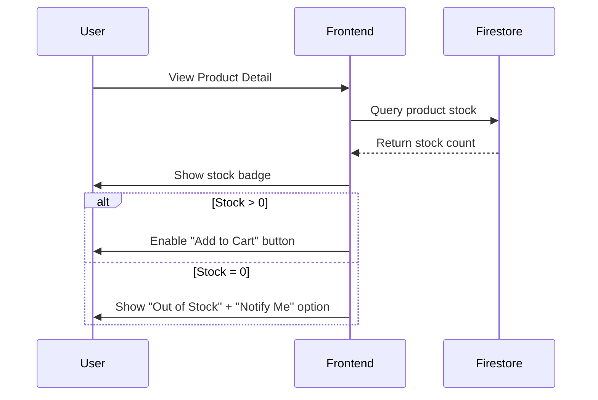
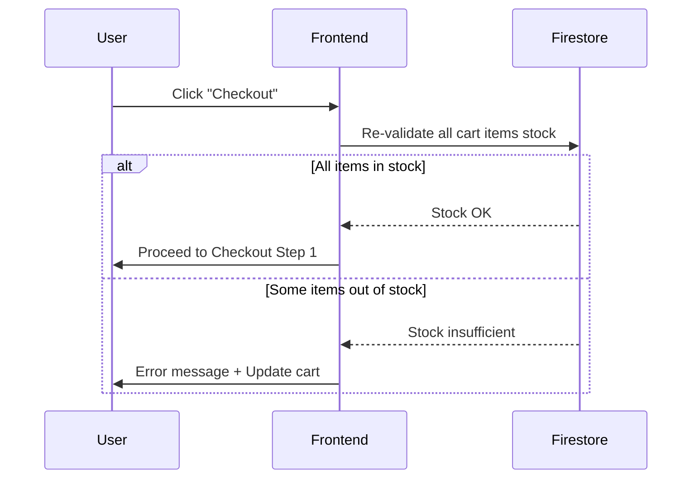
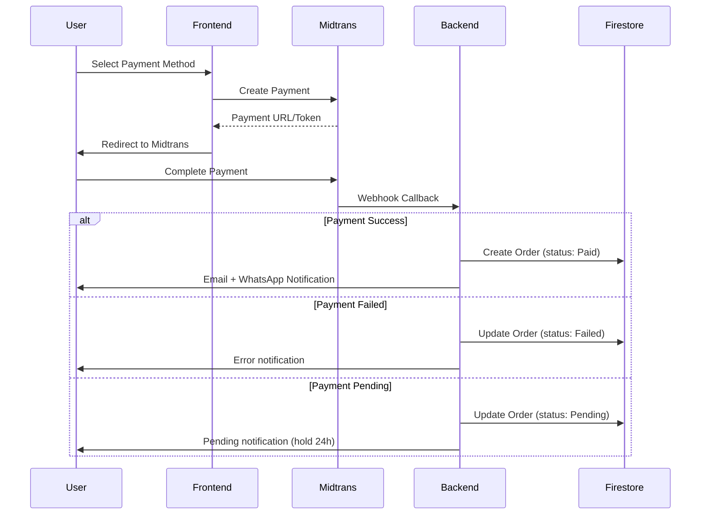

# User Flow - Turen Indah Bangunan

> **Phase 3.1:** User Flow & Journey Mapping  
> **Purpose:** Visualize end-to-end user journey dari landing hingga order tracking  
> **Persona:** Budi (Kontraktor), Rina (Renovator), Pak Hendra (Pemilik Toko B2B)

---

## User Flow Diagram (Mermaid)

```mermaid
flowchart TD
    Start([User Mengunjungi Website]) --> Landing[Landing Page]
    
    Landing --> Browse{Pilihan User}
    Browse -->|Search Product| Search[Search Bar + Autocomplete]
    Browse -->|Browse Category| Category[Category Page]
    Browse -->|View Featured| Featured[Featured Products Section]
    
    Search --> ProductList[Product Catalog Grid]
    Category --> ProductList
    Featured --> ProductList
    
    ProductList --> Filter{Apply Filters?}
    Filter -->|Yes| ApplyFilter[Filter: Kategori, Harga, Brand]
    Filter -->|No| ProductCard[Product Card List]
    ApplyFilter --> ProductCard
    
    ProductCard --> ProductDetail[Product Detail Page]
    
    ProductDetail --> StockCheck{Stock Available?}
    StockCheck -->|Out of Stock| OutOfStock[Show: Out of Stock Badge<br/>Option: Notify Me]
    StockCheck -->|Available| AddToCart{User Action}
    
    AddToCart -->|Add to Cart| Cart[Shopping Cart Page]
    AddToCart -->|Continue Shopping| ProductList
    OutOfStock --> ProductList
    
    Cart --> CartValidation{Cart Empty?}
    CartValidation -->|Yes| EmptyCart[Empty Cart Message<br/>Suggest Products]
    CartValidation -->|No| CartActions{User Action}
    
    CartActions -->|Edit Quantity| UpdateCart[Update Cart Item]
    CartActions -->|Remove Item| RemoveCart[Remove from Cart]
    CartActions -->|Checkout| PreCheckoutValidation{Re-check Stock}
    
    UpdateCart --> Cart
    RemoveCart --> Cart
    EmptyCart --> ProductList
    
    PreCheckoutValidation -->|Stock OK| AuthCheck{User Logged In?}
    PreCheckoutValidation -->|Out of Stock| StockError[Error: Item Out of Stock<br/>Remove or Update Cart]
    StockError --> Cart
    
    AuthCheck -->|Guest Checkout| GuestInfo[Enter Email + Phone]
    AuthCheck -->|Login| LoginForm[Login Form]
    AuthCheck -->|Already Logged In| CheckoutStep1
    
    GuestInfo --> CheckoutStep1[Checkout Step 1:<br/>Address Information]
    LoginForm --> CheckoutStep1
    
    CheckoutStep1 --> AddressValidation{Valid Address?}
    AddressValidation -->|Invalid| AddressError[Error: Invalid/Incomplete Address<br/>Inline Validation]
    AddressValidation -->|Valid| CheckoutStep2[Checkout Step 2:<br/>Shipping Method]
    AddressError --> CheckoutStep1
    
    CheckoutStep2 --> ShippingCalc[RajaOngkir API:<br/>Calculate Shipping Cost]
    ShippingCalc --> SelectShipping[Select Courier + Service]
    SelectShipping --> CheckoutStep3[Checkout Step 3:<br/>Payment Method]
    
    CheckoutStep3 --> SelectPayment{Payment Method}
    SelectPayment -->|VA Bank| PaymentVA[Virtual Account]
    SelectPayment -->|E-Wallet| PaymentEwallet[GoPay/OVO/DANA]
    SelectPayment -->|COD| PaymentCOD[Cash on Delivery]
    
    PaymentVA --> MidtransIntegration[Midtrans Payment Gateway]
    PaymentEwallet --> MidtransIntegration
    PaymentCOD --> CreateOrder[Create Order]
    
    MidtransIntegration --> PaymentStatus{Payment Status}
    PaymentStatus -->|Success| CreateOrder
    PaymentStatus -->|Failed| PaymentFailed[Error: Payment Failed<br/>Reason: Insufficient Balance, Timeout, etc.]
    PaymentStatus -->|Pending| PaymentPending[Status: Payment Pending<br/>Hold Order 24h]
    
    PaymentFailed --> RetryPayment{User Action}
    RetryPayment -->|Retry| CheckoutStep3
    RetryPayment -->|Cancel| OrderCancelled[Order Cancelled]
    RetryPayment -->|Contact Support| SupportContact[WhatsApp Support]
    
    CreateOrder --> OrderConfirmation[Order Confirmation Page<br/>Order ID + Summary]
    OrderConfirmation --> EmailNotification[Email + WhatsApp Notification]
    EmailNotification --> OrderTracking[Order Tracking Page]
    
    OrderTracking --> TrackingStatus{Order Status}
    TrackingStatus --> StatusProcessing[Status: Diproses]
    TrackingStatus --> StatusShipped[Status: Dikirim<br/>Tracking Number]
    TrackingStatus --> StatusDelivered[Status: Selesai]
    
    StatusShipped --> TrackingLink[Link to Courier Tracking]
    StatusDelivered --> OrderComplete([Order Complete])
    
    OrderTracking --> ReorderOption[Option: Beli Lagi]
    ReorderOption --> Cart
    
    OrderCancelled --> End([End])
    OrderComplete --> End
    SupportContact --> End
```

---

## User Flow Breakdown

### 1. Landing Page → Browse

**Touchpoints:**

- Hero section dengan CTA (Search Bar, Browse Categories)
- Featured Products carousel
- Categories grid dengan images
- Footer dengan product catalog links

**User Actions:**

- Search produk (autocomplete suggestions)
- Click kategori (Semen, Bata Ringan, Keramik, dll.)
- View featured products

**Tech Implementation:**

- Server-side rendering (SSR) untuk SEO
- Search autocomplete dengan Algolia atau Firestore query
- Category filter dari `categories` collection

---

### 2. Browse → Product Detail

**Touchpoints:**

- Product catalog grid (responsive, mobile-first)
- Filters: Kategori, Harga, Brand, Sort
- Product card: Image, Title, Price, Stock Badge, Quick View

**User Actions:**

- Apply filters/sort
- Click product card → Product Detail Page (PDP)

**Real-time Stock Check:**

---

### 3. Product Detail → Cart

**Touchpoints:**

- Product gallery (multiple images, zoom)
- Product specs (material, size, weight, etc.)
- Stock badge (In Stock / Low Stock / Out of Stock)
- Quantity selector
- Add to Cart button

**Validation:**

- Client-side: Quantity > 0, < max stock
- Server-side: Re-validate stock before adding to cart

**State Management:**

- Cart data: Zustand store (client-side)
- Persistence: sessionStorage (guest) + Firestore (logged-in user)

---

### 4. Cart → Checkout (3 Steps)

**Step 1: Address Information**

- If logged in: Select saved address or add new
- If guest: Enter email, phone, address
- Validation: Required fields, postal code format

**Step 2: Shipping Method**

- RajaOngkir API integration
- Calculate cost based on: Origin (TIB warehouse), Destination (user address), Weight
- Display: Multiple courier options (JNE, TIKI, JNT, etc.)

**Step 3: Payment Method**

- Midtrans/Xendit integration
- Options: VA Bank, E-Wallet (GoPay, OVO, DANA), COD (conditional)
- Display: Payment instructions

**Pre-Checkout Validation:**

---

### 5. Payment → Order Tracking

**Payment Flow:**

**Order Tracking:**

- Order status updates: Diproses → Dikirim → Selesai
- Push notifications (email, WhatsApp)
- Tracking number integration dengan courier API
- "Beli Lagi" button untuk reorder

---

## Edge Cases Handling

### Edge Case 1: Out of Stock

**Scenario:** User adds product to cart, but stock habis sebelum checkout

**Flow:**

1. User click "Checkout"
2. System re-validates stock untuk semua cart items
3. If stock insufficient:
   - Show error message: "Maaf, [Product Name] stok tidak mencukupi"
   - Update cart item dengan max available stock
   - Option: Remove item atau adjust quantity

**Prevention:**

- Real-time stock badge di product card
- Disable "Add to Cart" jika stock = 0
- (Future) "Notify me when available" feature

---

### Edge Case 2: Payment Failed

**Scenario:** Payment gagal karena insufficient balance, timeout, atau technical error

**Flow:**

1. Midtrans webhook callback dengan status "Failed"
2. Order status updated: "Payment Failed"
3. User notification dengan reason
4. Options:
   - **Retry Payment**: Redirect back to payment page
   - **Change Payment Method**: Back to Checkout Step 3
   - **Contact Support**: WhatsApp deep link
5. Order hold for 24h, auto-cancel jika tidak dibayar

**Error Messages:**

- "Pembayaran gagal: Saldo tidak mencukup"
- "Pembayaran gagal: Waktu pembayaran habis (timeout)"
- "Pembayaran gagal: Terjadi kesalahan teknis"

---

### Edge Case 3: Invalid Address

**Scenario:** User input alamat yang tidak valid atau tidak lengkap

**Validation Levels:**

1. **Client-side (Inline)**:
   - Required fields check
   - Postal code format (5 digits)
   - Phone format (starts with 08, 10-13 digits)

2. **Server-side (RajaOngkir API)**:
   - Validate city/district exists
   - If invalid: Return error before shipping calculation

**Flow:**

1. User input address di Checkout Step 1
2. Click "Next"
3. System validates:
   - If invalid: Show inline error message + highlight field
   - Block proceeding to Step 2
4. User fix address → Re-validate → Proceed

**Error Messages:**

- "Alamat tidak boleh kosong"
- "Kode pos tidak valid (harus 5 digit)"
- "Nomor telepon tidak valid"
- "Kota/kecamatan tidak ditemukan"

---

## Mobile-First Considerations

### Responsive Breakpoints

- **Mobile**: < 640px (1 column grid)
- **Tablet**: 640px - 1024px (2-3 column grid)
- **Desktop**: > 1024px (4 column grid)

### Mobile-Specific UX

- **Sticky Search Bar**: Always accessible di top
- **Sticky "Add to Cart"**: Button fixed at bottom on PDP
- **Mobile Checkout**: Single-page form (collapsible steps)
- **WhatsApp Integration**: One-tap deep link

---

## Next Steps

1. **Validate Flow**: Review dengan PRD user stories
2. **Create Admin Flow**: Separate document untuk admin panel
3. **Journey Map**: Detailed persona journey dengan emotions/touchpoints
4. **Wireframes**: Visual mockup berdasarkan approved flow

---

*Last updated: 6 Januari 2026*
