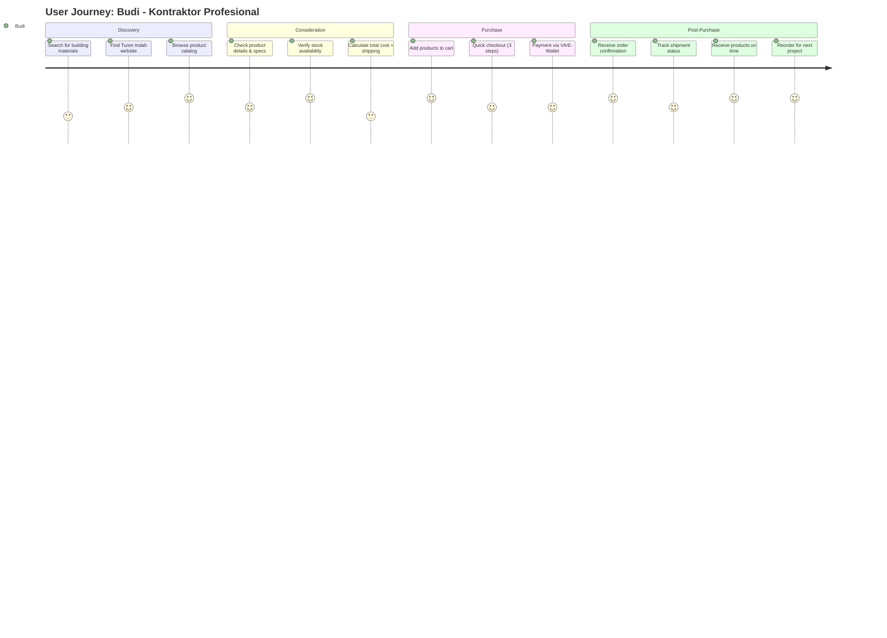
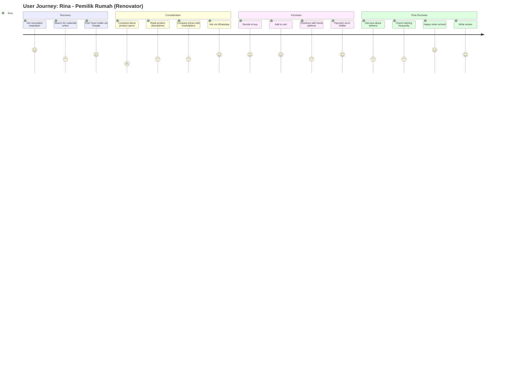
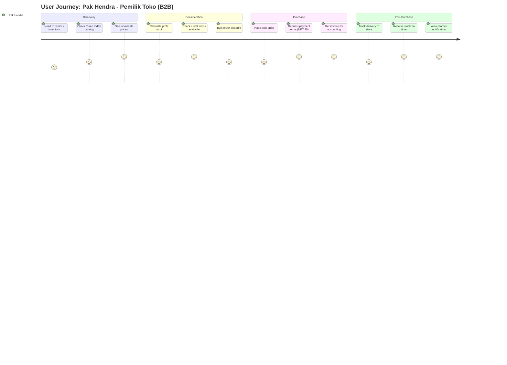

# User Journey Map - Turen Indah Bangunan

> **Phase 3.1:** User Journey Mapping  
> **Purpose:** Understand emotional journey dan pain points for each persona  
> **Personas:** Budi (Kontraktor), Rina (Renovator), Pak Hendra (Pemilik Toko B2B)

---

## Journey Map Diagram (Mermaid)







---

## Detailed Journey Map: Budi - Kontraktor Profesional

### Persona Profile

| Attribute | Detail |
|-----------|--------|
| **Name** | Budi, 42 tahun |
| **Profession** | Kontraktor independen dengan 5 pekerja |
| **Location** | Surabaya, Jawa Timur |
| **Digital Savviness** | Menengah (WhatsApp, Tokopedia familiar) |
| **Purchase Frequency** | 3-5x per minggu |
| **Average Order Value** | Rp 5-50 juta |
| **Primary Device** | Mobile (60%), Desktop (40%) |

### Goals

1. ✅ Hemat waktu pengadaan material (no bolak-balik toko)
2. ✅ Pastikan stok tersedia saat dibutuhkan
3. ✅ Pengiriman tepat waktu ke lokasi proyek
4. ✅ Harga kompetitif untuk margin profit

### Pain Points (Current State - TIB Website Lama)

1. ❌ Harus telepon/WhatsApp untuk cek stok → **Waste Time**
2. ❌ Sering kehabisan material di tengah proyek → **Project Delay**
3. ❌ Tidak tahu status pengiriman → **Uncertainty**
4. ❌ Website lambat dan sulit navigasi → **Frustration**
5. ❌ Proses checkout ribet → **Abandoned Cart**

---

## Journey Stages Breakdown

### Stage 1: Discovery (🤔 Awareness)

**Scenario:** Budi dapat proyek renovasi rumah 2 lantai, butuh semen, bata ringan, dan keramik.

| Touchpoint | Action | Emotion | Thought | Opportunity |
|------------|--------|---------|---------|-------------|
| Google Search | Search "beli semen Surabaya online" | 😐 Neutral | "Mana yang paling lengkap dan terpercaya?" | **SEO optimization**, "Stok Real-time" badge di meta description |
| Landing Page | First impression TIB website | 😊 Positive | "Website baru, clean!" | **Fast load time (<3s)**, Hero with clear CTA |
| Browse Catalog | Click "Kategori Semen" | 😃 Happy | "Produknya lengkap, ada foto jelas" | **Category icons**, **Stock badge** prominent |

**Key Metrics:**

- Time to find product: **< 2 minutes** (vs 10 minutes di website lama)
- Bounce rate: **< 40%** (target)

---

### Stage 2: Consideration (🧐 Evaluation)

**Scenario:** Budi compare products, cek stok, dan calculate total cost.

| Touchpoint | Action | Emotion | Thought | Opportunity |
|------------|--------|---------|---------|-------------|
| Product Detail | View "Semen Gresik 50kg" | 😊 Confident | "Spesifikasi lengkap, ada stock badge!" | **Real-time stock**: "Stok: 150 sak" |
| Spec Check | Read technical specs | 😌 Relieved | "Pas yang saya butuhin" | **Clear specs**: Material, application, coverage |
| Calculate | Use calculator (manual) | 😕 Annoyed | "Ribet hitung sendiri..." | **Future**: Quantity calculator (e.g., "Untuk 100m² butuh X sak") |
| Shipping Estimate | Input address for estimate | 😐 Neutral | "Ongkir wajar, oke lah" | **RajaOngkir integration**, Multiple courier options |
| Compare Price | Check Tokopedia | 😃 Happy | "Harga sama, tapi ini lebih cepat!" | **Price transparency**, "Best price guarantee" badge |

**Key Metrics:**

- Time on product page: **2-3 minutes** (engaged)
- Add to cart rate: **> 30%**

**Pain Point Addressed:**

- ✅ Stok visibility (real-time badge)
- ✅ Shipping cost transparency (auto-calculate)

---

### Stage 3: Purchase (💳 Decision)

**Scenario:** Budi checkout dengan 3 produk (total Rp 15 juta).

| Touchpoint | Action | Emotion | Thought | Opportunity |
|------------|--------|---------|---------|-------------|
| Cart Page | Review cart items | 😊 Satisfied | "Semua yang saya butuh ada" | **Quick edit**: Quantity, Remove |
| Checkout Step 1 | Enter delivery address | 😐 Neutral | "Alamat proyek, bukan kantor..." | **Saved addresses** (if logged in), **Autocomplete** |
| Checkout Step 2 | Select shipping method | 😕 Concerned | "JNE REG 3-5 hari, oke" | **Delivery date estimator**: "Estimasi tiba: 10 Jan" |
| Checkout Step 3 | Choose payment: VA BCA | 😊 Easy | "Tinggal transfer aja" | **Multiple options**: VA, E-Wallet, COD |
| Payment Page | Open BCA mobile, transfer | 😐 Neutral | "Nomor VA jelas" | **Auto-copy VA number**, WhatsApp reminder |
| Order Confirmation | See "Order Berhasil" | 😃 Happy | "Gampang ternyata!" | **Clear next steps**: "Kami proses dalam 1 jam" |

**Key Metrics:**

- Checkout completion rate: **> 70%** (vs 30% di website lama)
- Average checkout time: **< 5 minutes**

**Pain Point Addressed:**

- ✅ Checkout cepat (<3 steps)
- ✅ Payment options flexible
- ✅ Clear order confirmation

---

### Stage 4: Post-Purchase (📦 Fulfillment)

**Scenario:** Budi tunggu pengiriman, track status, terima barang.

| Touchpoint | Action | Emotion | Thought | Opportunity |
|------------|--------|---------|---------|-------------|
| Email Notification | Receive "Order Dikonfirmasi" | 😊 Assured | "Oke, lanjut" | **Email + WhatsApp** dual notification |
| WhatsApp Notif | "Pesanan Anda sedang diproses" | 😊 Informed | "Responsive!" | **Proactive updates**, not spam |
| Order Tracking Page | Check status: "Dikirim" | 😃 Relieved | "Udah dikirim, mantap" | **Tracking number link**, Live map (future) |
| Delivery Day | Courier arrives on time | 😃 Very Happy | "Tepat waktu! Proyek nggak delay!" | **SMS alert**: "Kurir 30 menit dari lokasi" |
| Reorder Option | See "Beli Lagi" button | 😍 Delighted | "Next project tinggal klik aja" | **One-click reorder**, Suggested products |

**Key Metrics:**

- Order tracking engagement: **> 60%** check tracking
- On-time delivery: **> 90%**
- Reorder rate: **> 40%** (repeat customers)

**Pain Point Addressed:**

- ✅ Tracking visibility (no more manual call/WA)
- ✅ On-time delivery (project continuity)
- ✅ Easy reorder (customer retention)

---

## Emotional Journey Graph

```
Emotion Level (1-5)
  5 |                            ✓ Order Berhasil    ✓ Delivered!
    |                          /                   /
  4 |        ✓ Stock Available                   /
    |      /                   \               /
  3 |    /   ○ Browse           ✓ Payment    /  ○ Track Status
    |   /                         \         /
  2 | ○ Search          ○ Calculate  \    /
    |                                   \/  ○ Checkout Step 1
  1 |___________________________________________________________________
     Discovery     Consideration    Purchase        Post-Purchase
```

**Key Insight:**

- **Highest Satisfaction**: Stok tersedia + Delivery tepat waktu
- **Lowest Points**: Calculate shipping manual, Checkout step 1 (address input)
- **Opportunity**: Auto-calculator, address autocomplete

---

## Journey Map: Rina - Pemilik Rumah (Renovator)

### Persona Profile

| Attribute | Detail |
|-----------|--------|
| **Name** | Rina, 35 tahun |
| **Profession** | Ibu rumah tangga + freelance designer |
| **Location** | Jakarta Selatan |
| **Digital Savviness** | Tinggi (Shopee, Tokopedia, Instagram) |
| **Purchase Frequency** | 1-2x per bulan (saat renovasi) |
| **Average Order Value** | Rp 500rb - 5 juta |
| **Primary Device** | Mobile (80%), Desktop (20%) |

### Goals

1. ✅ Renovasi sesuai budget (transparent pricing)
2. ✅ Beli produk yang tepat (tidak salah beli)
3. ✅ Harga tidak markup tukang (direct dari toko)

### Pain Points

1. ❌ Tidak paham spesifikasi teknis → **Confusion**
2. ❌ Takut salah beli, tidak bisa retur → **Risk Averse**
3. ❌ Harga beda-beda, tidak transparan → **Distrust**

### Journey Highlights

**Stage 1: Discovery (😊 Curious)**

- Pinterest → Google Search → TIB Website
- Impressed by clean UI dan product photos
- **Opportunity**: Instagram-worthy product images, Inspiration gallery

**Stage 2: Consideration (😕 Confused → 😊 Helped)**

- Bingung: "Keramik ukuran berapa untuk kamar mandi 3x3m?"
- Click WhatsApp → Chat dengan CS → Get recommendation
- **Opportunity**: **AI Chatbot** untuk basic questions, **Product guides** (e.g., "Panduan Memilih Keramik")

**Stage 3: Purchase (😃 Confident)**

- Add keramik + lem + nat sekaligus (bundle recommendation)
- Checkout dengan alamat rumah
- Payment via GoPay (instant)
- **Opportunity**: **Product bundles** (keramik + accessories), **1-click payment**

**Stage 4: Post-Purchase (😰 Anxious → 😃 Relieved)**

- Cemas: "Kapan datang? Jangan sampai pecah..."
- Track order: 5x dalam 2 hari
- Delivery: Barang aman, packaging rapi
- Write review: 5 stars
- **Opportunity**: **Proactive updates** (reduce anxiety), **Packaging quality**, **Review incentives**

---

## Journey Map: Pak Hendra - Pemilik Toko (B2B)

### Persona Profile

| Attribute | Detail |
|-----------|--------|
| **Name** | Pak Hendra, 55 tahun |
| **Profession** | Pemilik toko bangunan (20 tahun) |
| **Location** | Semarang, Jawa Tengah |
| **Digital Savviness** | Rendah-Menengah (WhatsApp, Excel) |
| **Purchase Frequency** | Harian (restock) |
| **Average Order Value** | Rp 20-200 juta |
| **Primary Device** | Desktop (70%), WhatsApp (30%) |

### Goals

1. ✅ Akses harga grosir kompetitif
2. ✅ Credit terms (NET 30/60 hari)
3. ✅ Restock cepat dan mudah

### Pain Points

1. ❌ Proses order masih via telepon/fax → **Manual**
2. ❌ Approval kredit lama (2-3 hari) → **Cash flow risk**
3. ❌ Data stok tidak akurat → **Overstock/stockout**

### Journey Highlights

**Stage 1: Discovery (😐 Routine)**

- Check Excel: "Semen Gresik tinggal 10 sak"
- Open TIB website: Browse catalog
- **Opportunity**: **Auto-reorder notification**, **B2B dashboard** with stock levels

**Stage 2: Consideration (😃 Impressed)**

- See wholesale price (20% off retail)
- Credit terms: NET 30 available (limit Rp 50 juta)
- **Opportunity**: **Transparent B2B pricing**, **Credit limit display**, **Bulk discount tiers**

**Stage 3: Purchase (😊 Smooth)**

- Add 100 sak semen to cart
- Checkout: Select "Payment Terms: NET 30"
- Get invoice PDF automatically
- **Opportunity**: **B2B checkout flow**, **Invoice auto-generation**, **PO reference field**

**Stage 4: Post-Purchase (😃 Satisfied)**

- Delivery: On-time, full quantity
- Invoice imported to accounting software (manual)
- Reorder next week: Same process, tapi faster
- **Opportunity**: **API integration** untuk accounting software, **Repeat order template**

---

## Cross-Persona Insights

### Common Pain Points (All Personas)

| Pain Point | Budi | Rina | Pak Hendra | Solution |
|------------|------|------|------------|----------|
| **Stock Uncertainty** | ✅ Critical | ✅ Moderate | ✅ Critical | **Real-time stock badge** |
| **Shipping Cost Surprise** | ✅ High | ✅ High | ✅ Moderate | **Auto-calculate** before checkout |
| **Unclear Product Specs** | ❌ Low | ✅ High | ❌ Low | **Detailed specs** + **Product guides** |
| **Payment Flexibility** | ✅ Moderate | ✅ High | ✅ Critical | **Multiple payment options** + **Credit terms** (B2B) |
| **Tracking Visibility** | ✅ Critical | ✅ High | ✅ Moderate | **Live tracking** + **Proactive notifications** |

### Persona-Specific Features

| Feature | Budi | Rina | Pak Hendra | Priority |
|---------|------|------|------------|----------|
| Real-time stock badge | 🔴 P0 | 🟡 P1 | 🔴 P0 | **P0** |
| Product guides/tutorials | 🟡 P2 | 🔴 P0 | ❌ - | **P1** |
| B2B pricing & credit terms | ❌ - | ❌ - | 🔴 P0 | **P1** (Phase 2) |
| One-click reorder | 🟡 P1 | 🟢 P2 | 🔴 P0 | **P1** |
| WhatsApp support | 🟡 P1 | 🔴 P0 | 🟡 P1 | **P0** |

---

## Recommendations for MVP

### Must-Have (P0)

1. ✅ **Real-time stock badge** on product cards
2. ✅ **Auto-calculate shipping** at checkout
3. ✅ **Mobile-first responsive design**
4. ✅ **WhatsApp integration** (sticky button + pre-filled message)
5. ✅ **Live order tracking** with status updates

### Should-Have (P1)

1. ⚠️ **Product guides** (e.g., "Cara Hitung Kebutuhan Semen")
2. ⚠️ **Saved addresses** untuk repeat customers
3. ⚠️ **One-click reorder** button
4. ⚠️ **Email + WhatsApp dual notifications**
5. ⚠️ **Product bundles** (e.g., Keramik + Lem + Nat)

### Nice-to-Have (P2 - Phase 2)

1. 💡 **AI Chatbot** untuk basic product questions
2. 💡 **Quantity calculator** (e.g., coverage calculator)
3. 💡 **Live delivery map** (Google Maps integration)
4. 💡 **B2B dashboard** dengan auto-reorder notification
5. 💡 **Review incentives** (discount for next order)

---

## Next Steps

1. **Validate Journey Maps**: Review dengan stakeholders
2. **Create Wireframes**: Based on approved touchpoints
3. **Define Design System**: Visual identity untuk emotional peaks
4. **Prototype Key Flows**: Interactive mockup untuk testing

---

*Last updated: 6 Januari 2026*
